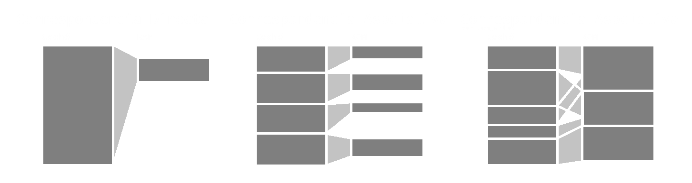
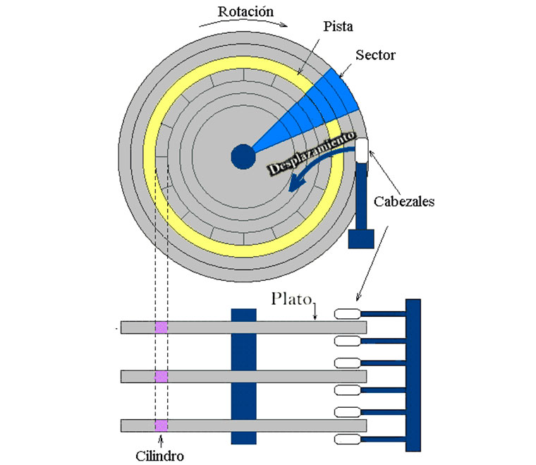
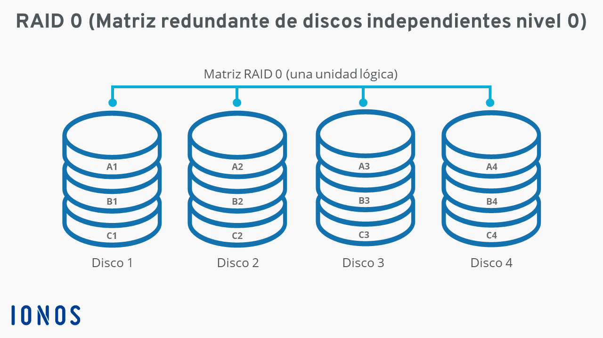
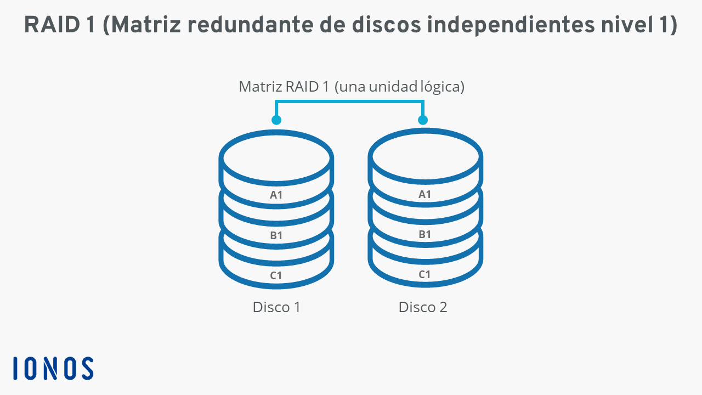
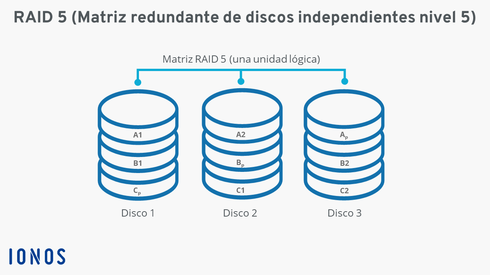

# **Administración de Redes y Servidores**
*Autor:* Christian Velasco Pérez 
\
El siguiente contenido corresponde a un **apoyo** educativo para cualquier interesado y por eso puede contener fallos. El documento está orientado al curso de *Administración de Redes y Servidores* del Grado en Ingeniería Informática de la Universidad de La Rioja y se considera completa responsabilidad del lector lo que haga con la información de este documento.
\
La distribución del documento queda reservada al permiso explícito de su autor. Si necesitase información de contacto puede [enviar un correo](mailto:velskopezz@gmail.com).

## Sobre la Administración de Redes y Servidores

Un **servidor** es una computadora que **provee de servicios a clientes**. También es el *software* que utilizan los servidores.
\
El *hardware* de un servidor es distinto y fundamentalmente **costoso** y necesitado de **mantenimiento**.

# TEMA 1: Introducción

Es imporante detectar que el *hardware* de servidor es para servidores por lo que no ofrecen las necesidades requeridas por los ordenadores de sobremesa. Los sistemas de servidores están hechos para **resistir fallos** mediante redundancias. Es lo que se llama **máquina Tolerante a Fallos**. Se aprecia **fidelidad**.

## Microprocesador

Constituye la **unidad central de procesamiento** (CPU). Se dedica a **materializad instrucciones** necesariamente escritas a **bajo nivel**.

Los microrocesadores de servidor **priorizan las tareas únicas** que se deben ejecutar con una temporalidad indefinida sobre la **apertura de flujos y procesos**.

> También existen los **servidores de apliación**, un punto intermedio entre computadores personales y servidores.

La diferencia radica en la **cantidad de memoria caché** que proporciona dificultades en **direccionamiento** de la inromación, lo que facilita la lectura pero dificulta la escritura.

Se distinguen categorías de microprocesadores de acuerdo con sus características:

- Microprocesadores **RISC** (Reduced Instruction Set Computer)
- Microprocesadores **CISC** (Complex Instruction Set Computer)
- Microprocesadores **EPIC** (Explicity Parallel Instruction Computer)

### Características evolutivas

> Alguna de la siguiente información no es totalmente fiel al documento. Se ha utilizado información actualizada.

#### Ejecución superescalar

Con el objetivo de aumentar la optimización se añadieron **tubos entrenúcleo**. Esto fue porque se notó que los distintos núcleos perdían tiempo esperando a la información.

#### Planificación dinámica

Funciona de tal forma que el núcleo planea la ida y llegada de información para paralelizarlo.

#### Arquitectura de doble bus independiente (DIB)

Proporciona dos BUSes para el acceso paralelo.

#### *Hyper-Threading Technology* (HT)

Utiliza **núcleos virtuales** para simultanear hilos entre secciones en tiempo compatibles. Aunque el núcleo físico adicional es mejor, el nivel virtual es casi como tener un núcleo más.

#### *Multi-core*

Proporciona múltiples **pares de núcleos** para que se dividan los ***threads*** de tal forma que se duplica la capacidad. Tiene un coste económico inferior que una CPU adicional.

#### Reducción de las tensiones

De forma gradual se logró pasar de **5V** a 3.3V y 1.8V hasta hoy con entre 0.7V y 1.2V. No obstante, llega un punto en el que el **ruido eléctrico** hace imposibilita la tarea de conversión de la señal eléctrica a digital.

### Disposición

Se proporciona una de las formas de calcular la resistencia total de un conjunto:

$$R_{\text{total}} = (T_{\text{case}} - T_{\text{inlet}})/P_{\text{max}} - R_{\text{junction}}$$

> $R_{\text{total}} \equiv \text{``Resistencia total"}$
> \
> $T_{\text{case}} \equiv \text{``Temperatura máxima óptima del CPU"}$
> \
> $T_{\text{inlet}} \equiv \text{``Temperatura ambiente"}$
> \
> $P_{\text{max}} \equiv \text{``Potencia máxima del CPU"}$
> \
> $R_{\text{junction}} \equiv \text{``Resistencia de la pasta térmica"}$

#### Ejemplos

1. **Disponemos de un microprocesador con un bus de direcciones de 32 bits y una memoria con longitud de palabra 8 bits.**
    
    1. **Calcular el tamaño del bloque máximo de memoria direccionable.**

        Se pueden direccionar un total de $2^{32} \cdot 8\text{b} \cdot \frac{1\text{B}}{8\text{b}} = 2^{32}\text{B}$.

    2. **Compararlo porcentualmente con el tamaño del bloque máximo de memoria direccionable en un procesador con bus de direcciones de 64 bits.**

        Con un BUS de 64 bits habría $2^{64} \cdot 1\text{B} = 2^{64}\text{B}$ direccionables.

        Dicho de otro modo, sería $\frac{2^{64}\text{B}}{2^{32}\text{B}} = 2^{32}$ veces mayor con un BUS de 64 bits.

2. **Disponemos de un procesador que necesita 26 ciclos de reloj para realizar una operación de movimiento de un dato entre memorias. Su frecuencia de trabajo es 20MHz.**
    
    1. **Calcular el tiempo que tarda en mover 1 dato.**

        Efectuamos un factor de conversión.

        $$1 \ \text{dato} \cdot 26 \ \frac{\text{ciclo}}{\text{dato}} \cdot \frac{1\text{s}}{20 \cdot 10^{6} \ \text{ciclo}} = 1.3 \cdot 10^{-6} \text{s} = 4.3 \mu\text{s}$$

    2. **Compararlo porcentualmente con el tiempo que tardaría en mover el dato si el procesador funcionara a 1GHz.**

        Con 1GHz tardaría 

        $$1 \ \text{dato} \cdot 26 \ \frac{\text{ciclo}}{\text{dato}} \cdot \frac{1\text{s}}{10^{9} \ \text{ciclo}} = 26 \cdot 10^{-9} \text{s} = 26 n\text{s}$$

        O, lo que es lo mismo, alrededor de $\frac{26n\text{s}^{-1}}{1.3\mu\text{s}^{-1}} = 50 = 5000\%$ más rápido.

3. **Calcular la resistencia térmica del conjunto del radiador a diseñar para permitir el funcionamiento correcto de un procesador en las siguientes condiciones:**

    > $$R_{\text{total}} = (T_{\text{case}} - T_{\text{inlet}})/P_{\text{max}} - R_{\text{junction}}$$

    - **Microprocesador con las siguientes características:**
        - $T_{\text{case}} = 73º\text{C}$
        - $T_{\text{inlet}} = 38º\text{C}$
        - $P_{\text{max}} = 103\text{W}$
        - Pasta térmica de silicona $0.01º\text{C}/\text{W}$

    $$R_{\text{total}} = (73º\text{C} - 38º\text{C})/103\text{W} - 0.01º\text{C}/\text{W} = 0.33º\text{C}/\text{W}$$

## Chipset

También visto como **socket**, es el componente **estandarizado** que **dictamina el soporte de ciertos tipos de procesadores**.

En servidores es comúm que haya **múltiples chipsets** en la placa madre. El múltiple procesador implica **cargas adicionales en control** por lo que no se suelen proporcionar para uso personal.

## Sistemas de memoria

Comúnmente llamada RAM por la tecnología que la implementa, se identifican dos tipos:
- **DRAM**: lenta
- **SRAM**: costosa

También se puede identificar la **memoria caché** y la **memoria virtual**.

La memoria **caché** es de tipo **SRAM** (extremadamente rápida por ello) dividida en entre **3** y 4 niveles.

### Memoria caché

Los datos se alojan en los distintos **niveles** de acuerdo con la **freuencia de uso**.

- **Caché inclusivo**: los datos se mantienen en su nivel de procedencia tras ser transferidos

- **Caché exclusivo**: los datos se extraen y eliminan de su nivel de procedencia tras ser transferidos

La ubicación de su memoria depende de su nivel:

- **L1**: Se encuentra **cercana al núcleo**. Su tamaño es **pequeño** para mover la totalida de información a golpe de clock.

- **L2**: Se encuentra más lejana al núcleo que el L1. Está planteada para funcionar de acuerdo con el reloj de la RAM.

- **L3**: Es más lenta que L2.

> Se trata de la tendencia generalizada. Los fabricantes son libres de alterar esto a su criterio.

#### Políticas de ubicación

Deciden dónde debe colocarse un bloque de memoria principal que ingresa a la caché:

#### Políticas de extracción

Deciden cuándo debe sacarse un bloque de la caché al procesador.

- por **demanda**: se ìde el bloque `n` y se lleva el bloque `n`
- por **prebúsqueda**: se pide el bloque `n` y se lleva dede el `n` hasta el `n + i`

#### Políticas de reemplazo

Deciden cuando un bloque debe abandonar la caché.

- aleatorio
- FIFO
- LRU (usado menos reciente)
- LFU (usado con menor frecuencia)

> Para más información sobre estos algoritmos véase el temario de Sistemas Operativos.

#### Políticas de actualización o escritura

Determinan el instante en el que se actualiza la informacion en memoria cuando se escribe en otra.

- En memoria principal

    - Escritura inmediata
        \
        Se escribe a la vez en memoria principal y caché manteniendo la coherencia.
    - Postescritura
        \
        El bloque donde se escribió queda marcado con un bit de basura a la espera de ser reescrito. Al reemplazo, se escribe la información en la memoria principal.

- Sobre la memoria caché

    - Asignación en escritura
        \
        El bloque referenciado se copia en la caché y, *después*, de la caché a la CPU.
    - No asignación en escritura
        \
        El bloque se envía y carga a la vez en la CPU y caché respectivamente.

### Disco duro magnético

Es una estrictura de varios platos, comúnmente de 6 a 8 a fecha de 2026. Estos giran a **7200rpm** y su dato es cambiado por un **cabezal magnético** por acción magnética; sin tocar el plato. Su tamaño depende de su factor de forma.

Son de aluminio ligero, salvo por la punta magnética, que debe de estar hecha de un material magnético como óxidos de hierro o cobalto.

La desventaja de los discos magnéticos es su **lentitud** debido a su naturaleza mecánica que requiere el movimiento del plato, al contrario que los discos sólidos (SSD).

> Con el fin de aumentar la velocidad de lectura en servidores se aumentaron las revoluciones a hasta 11000rpm.

$$TA = t_{\text{búsqueda}} + t\text{lectura/escritura} + \text{``Latencia"}$$

> $TA \equiv \text{``tiempo medio en obtener la información"}$
> \
> $t_{\text{búsqueda}} \equiv \text{``tiempo medio en leer el disco"}$
> \
> $t_{\text{lectura/escritura}} \equiv \text{``tiempo medio de leer y escribir"}$
> \
> $\text{``Latencia"} \equiv \text{``tiempo de la aguja en situarse en el lugar adecuado"}$

- **Tasa de transferencia**: incluye la velocidad para transferir la información

- **Caché de disco**: permite la lectura de datos antes de que los pida el procesador tras almacenarlo en una pequeña caché

- **Interfaz**: se incluye IDE/ATA, SATA, SCSI, USB...

En busca de velocidad se crearon los discos **SAS**, variantes de SATA con mayor velocidad y fiabilidad pero de menor capacidad así como se crearon discos **SSD**, sin componentes mecánicos al usar memorias *flash*.

#### Tolerancia a fallos: Configuraciones RAID

Hay múltiples configuraciones RAID. Se mostrarán los RAID 0, 1 y 5 puesto que los RAID 2, 3, 4, 6 y 1+0 o 10 son o bien combinaciones de esos tres o bien RAID 5 con volúmenes u otras unidades de niveles de almacenamiento.

- **RAID 0**

    Consiste en hacer ***stripping***: en cada disco se guarda un bloque con la información.
    
    Es una alternativa rápida puesto que se multiplica la velocidad de lectura y escritura, pero es insegura puesto que depende de todos los discos.

    

- **RAID 1**

    Consiste en hacer ***mirrowing***.

    Favorece la seguridad al copiar la informacion, pero aumenta la carga de trabajo.

    

- **RAID 5**

    Distribuye información de **paridad** que permite la reconstrucción de la información. Requiere, al menos, **tres discos**.

    

#### JBOD

De ***Just a Bunch Of Drives***, es equivalente a RAID 0 con **aleatoriedad en las unidades**. Permiten unidades de distinto tamaño sin desperdiciar espacio disponible por ello.

## Sistemas de vídeo

Son poco útiles y generan **poca carga y calor**.

## Adaptadores de red

Es un recurso importante puesto que de esto depende la comunicación del servidor.

### Tarjetas de red

Las **NIC** de servidores tienen 2 adaptadores para, lejos de duplicar el ancho de banda, la **tolerancia a fallos**.

> El ancho de banda no suele ser limitante desde el lado del computador sino desde la contratación.

Cada adaptador de red viene con su dirección MAC única en una memoria ROM y cuyo valor viene fijado por el IEEE.

Para la transmisión de información se usan **NRZ**, **NRZ-I**, **Manchester** y **Manchester diferencial**.

> Para más información, véase la información en [Redes de Computadores](../2º/Redes_de_Computadores.md).

### Técnicas contra fallos

- Redundancia
- Replicación
- Distribución
- Autocorreción
- ...

### Infraestructura

En PYMEs suele ser más holgado, aunque en **centros de datos** se tiene en cuenta:

- ubicación segura
- acceso fácil
- instalación eléctrica y de telecomunicaciones
- capacidad de evacuación del calor
- estructura resistente al peso
- protección contra desastres

Estas dificultades llevan a muchos a elegir **alternativas Cloud**.

# TEMA 2: Introducción a la estructura cliente-servidor

Funciona de forma que un dispositivo servidor proporciona servicios a múltiples clientes. Para enviar información por la red se usan sistemas y tecnologías como las capas de Internet, Ethernet, segmentación, multiplexación...

> Buena parte de la información de este tema consiste en un resumen de lo visto en [Redes de Computadores](../2º/Redes_de_Computadores.md). Toda esa información queda omitida en este documento.