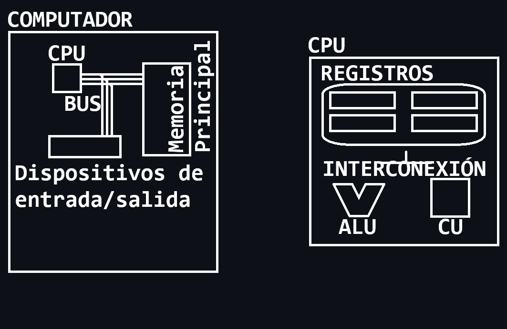
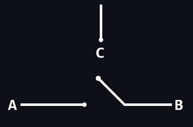

# **Arquitectura de Computadores**
*Autor:* Christian Velasco Pérez 
\
El siguiente contenido corresponde a un **apoyo** educativo para cualquier interesado y por eso puede contener fallos. El documento está orientado al curso de *Arquitectura de Computadores* del Grado en Ingeniería Informática de la Universidad de La Rioja y se considera completa responsabilidad del lector lo que haga con la información de este documento.
\
La distribución del documento queda reservada al permiso explícito de su autor. Si necesitase información de contacto puede [enviar un correo](mailto:velskopezz@gmail.com).

## Sobre la Arquitectura de Computadores
Se refiere a los **atributos** del computador que resutlan **visibles** para el programador y que debe conocer para programar **cada uno de los computadores** y para **programar a bajo nivel**.

# TEMA 1: Introducción
## Funciones básicas del computador
Se distinguen 4 funciones básicas divididas en componentes:
- **Procesamiento**
- **Almacenamiento** persistente y no persistente
- **Transferencia** de entrada, salida y comunicación
- **Control**

> Nota: Se asocia:
> 
> CPU con procesamiento y control.
> \
> Memoria principal con almacenamiento.
> \
> Dispositivos de entrada/salida con transferencia.

Memoria interna | |
--: | :--
Mayor velocidad | Registros de CPU
| | Memoria caché
| | Memoria principal

Memoria externa | |
--: | :--
| | Disco duro
Mayor capadidad/coste | Otros

# TEMA 2: Evolución de los computadores
## Generaciones
Indican la tecnología basada para crear el computador.

Un **elemento de conmutación** es un dispositov en el que se puede controlar la circulación de la **corriente eléctrica** entre dos terminales mediante la aplicación de un nivel de la tensión eléctrica en un **tercer terminal de control**.

Los elementos de conmutación son los **elementos básicos para contruir las puertas lógicas y biestables** que constituyen los **circuitos digitales**. Las generaciones de computadores vienen dados por la forma de implementarlo:
- **Gen1**: tubos de vacío / válvulas
- **Gen2**: transistores

### Generación 1
Utilizaba válvulas y es la generación de **ENIAC**, el primer computador de **propósito generalizado**, es decir, con fines **reprogramables**. Se trata del **primer computador digital**. Fue producto de la reprogramación de una calculadora de tablas de armas que no llegó a tiempo (1947) para la Segunda Guerra Mundial.
\
Funciona según el paradigma del **programa cableado**. Para cambiar el programa es necesario alterar conexiones y conmutadores, es decir, tocar cableado.

También es la generación del **computador IAS** (*Institute for Advanced Studies*), también llamada "***la máquina de von Neumann***", funcionaba con el paradigma del **programa almacenado**, es decir, almacena representaciones de secuencias de cálculo junto con los datos en la memoria principal.
\
Esta arquitectura se ha mantenido hasta ser hoy en día la más utilizada en la mayoría de computadoras. Funciona de tal manera que en memoria se almacenan **datos** e **intrucciones**.

- **Datos**: significan cosas
- **Instrucciones**: hacen cosas

Existe, además, una alternativa: la **arquitectura Harvard**.

### Generación 2
Existían inconvenientes que creaban la necesidad de un cambio. Los computadores de primera generación eran:

- voluminosos (ENIAC: +2000 válvulas)
- pesados (ENIAC: +30t)
- eléctricamente costoso (ENIAC: bombillas)
- calurosos (ENIAC: ~140kW)
- se pueden fundir

Estos problemas persistieron hasta 1947 con la llegada del **transistor** que lograba las funcionalidades necesarias de ENIAC sin las inconveniencias mencionadas.
\
Se dice que el transistor es un **dispositivo de estado sólido** por su indivisibilidad.

Es la ventaja del transistor la que constituye la segunda generación.

### Generación 3
El problema de los transistores es que generan **inseguridad** puesto que pueden caerse y necesitar ser **resoldados**. Conforme aumentaba la complejidad de los computadores también lo hacía su cantidad de transistores, aumentando el peligro.

Por contraparte, se decidió **unir múltiples transistores en un único silicio** para constituir piezas diferenciadas. Es decir, deshacerse de **componentes discretos** en forma de transistor para crear un **circuito integrado**.
\
En 1958 nace el primer **circuito integrado** comenzando así la **era de la microelectrónica**.

De acuerdo con la **Ley de Moore**, cada 1.5 años se duplica la cantidad de transistores que se pueden unir a un circuito integrado.
\
Escalas de integración:
- **SSI** (Small Scale of Integration)
- **MSI** (Medium Scale of Integration)
- **LSI** (Large Scale of Integration)
- **VLSI** (Very Large Scale of Integration)
- **ULSI** (Ultra Large Scale of Integration)

Es **consecuencia de la Ley de Moore**:
- **Precios accesibles**
    > Por la capacidad del hardware.
- **Mayor velocidad**
    > Por la proximidad de los transistores.
- **Menor consumo**
    > Por transistor.
- **Menor calentamiento**
    > Por el menor consumo.
- **Mayor versatilidad**
    > Por capacidad de hardware.
- **Mayor conssitencia**