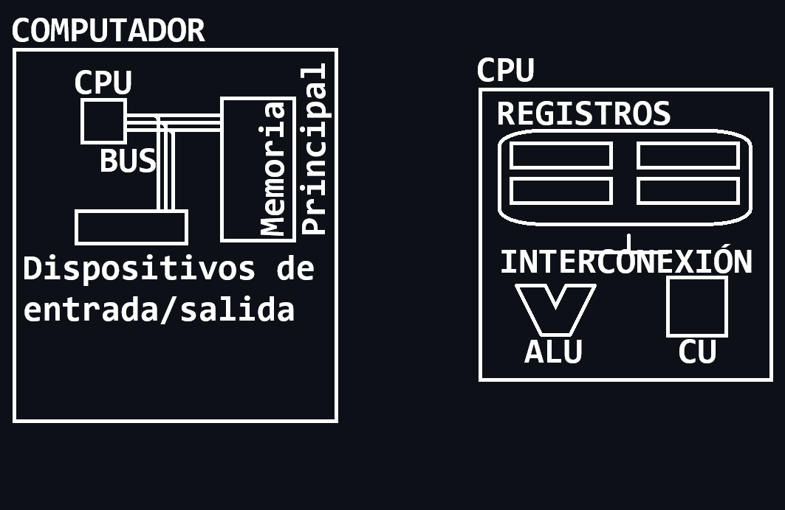
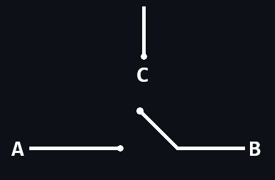
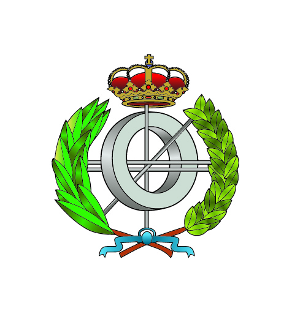
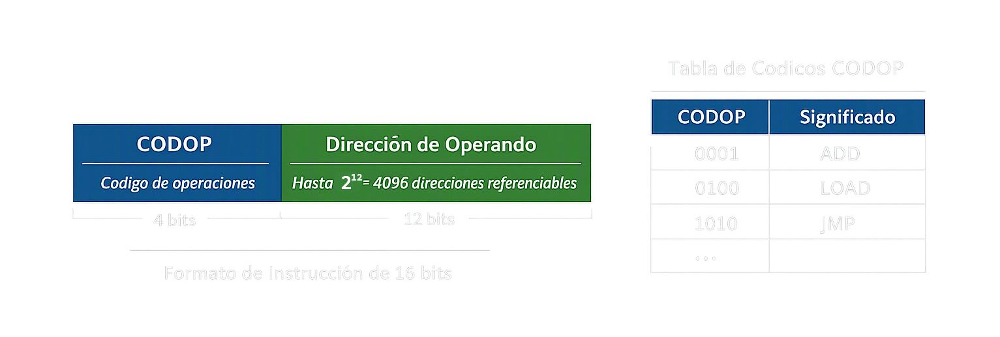
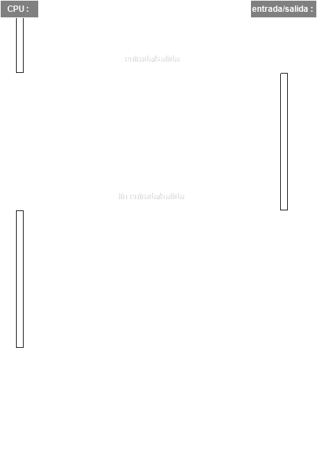
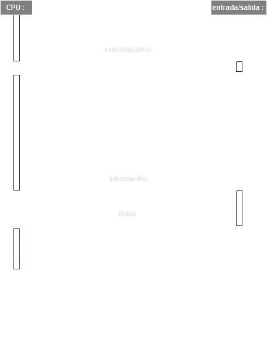
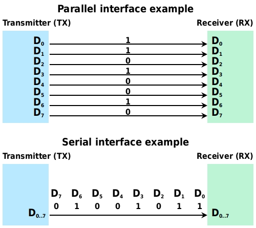
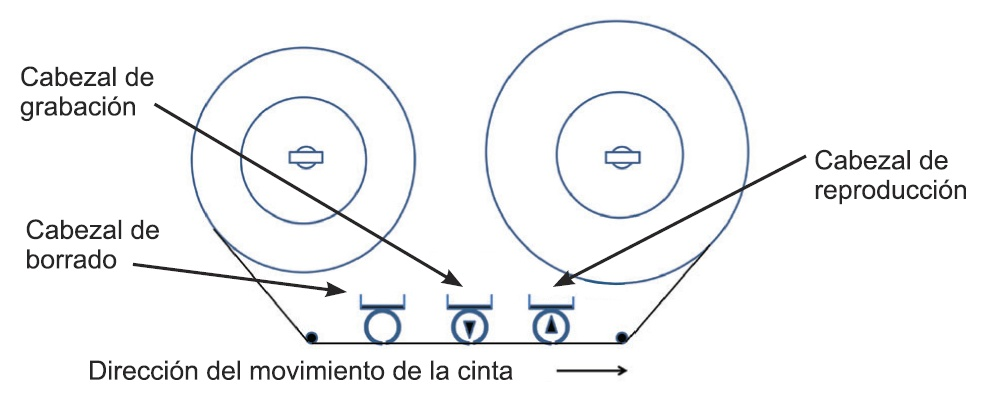

# **Arquitectura de Computadores**
*Autor:* Christian Velasco Pérez 
\
El siguiente contenido corresponde a un **apoyo** educativo para cualquier interesado y por eso puede contener fallos. El documento está orientado al curso de *Arquitectura de Computadores* del Grado en Ingeniería Informática de la Universidad de La Rioja y se considera completa responsabilidad del lector lo que haga con la información de este documento.
\
La distribución del documento queda reservada al permiso explícito de su autor. Si necesitase información de contacto puede [enviar un correo](mailto:velskopezz@gmail.com).

## Sobre la Arquitectura de Computadores
Se refiere a los **atributos** del computador que resutlan **visibles** para el programador y que debe conocer para programar **cada uno de los computadores** y para **programar a bajo nivel**.

# TEMA 1: Introducción
## Funciones básicas del computador
Se distinguen 4 funciones básicas divididas en componentes:
- **Procesamiento**
- **Almacenamiento** persistente y no persistente
- **Transferencia** de entrada, salida y comunicación
- **Control**

> Se asocia:
> 
> CPU con procesamiento y control.
> \
> Memoria principal con almacenamiento.
> \
> Dispositivos de entrada/salida con transferencia.

Memoria interna | |
--: | :--
Mayor velocidad | Registros de CPU
| | Memoria caché
| | Memoria principal

Memoria externa | |
--: | :--
| | Disco duro
Mayor capadidad/coste | Otros

# TEMA 2: Evolución de los computadores
## Generaciones
Indican la tecnología basada para crear el computador.

Un **elemento de conmutación** es un dispositov en el que se puede controlar la circulación de la **corriente eléctrica** entre dos terminales mediante la aplicación de un nivel de la tensión eléctrica en un **tercer terminal de control**.

Los elementos de conmutación son los **elementos básicos para contruir las puertas lógicas y biestables** que constituyen los **circuitos digitales**. Las generaciones de computadores vienen dados por la forma de implementarlo:
- **Gen1**: tubos de vacío / válvulas
- **Gen2**: transistores

### Generación 1
Utilizaba válvulas y es la generación de **ENIAC**, el primer computador de **propósito generalizado**, es decir, con fines **reprogramables**. Se trata del **primer computador digital**. Fue producto de la reprogramación de una calculadora de tablas de armas que no llegó a tiempo (1947) para la Segunda Guerra Mundial.
\
Funciona según el paradigma del **programa cableado**. Para cambiar el programa es necesario alterar conexiones y conmutadores, es decir, tocar cableado.

También es la generación del **computador IAS** (*Institute for Advanced Studies*), también llamada "***la máquina de von Neumann***", funcionaba con el paradigma del **programa almacenado**, es decir, almacena representaciones de secuencias de cálculo junto con los datos en la memoria principal.
\
Esta arquitectura se ha mantenido hasta ser hoy en día la más utilizada en la mayoría de computadoras. Funciona de tal manera que en memoria se almacenan **datos** e **intrucciones**.

- **Datos**: significan cosas
- **Instrucciones**: hacen cosas

Existe, además, una alternativa: la **arquitectura Harvard**.

### Generación 2
Existían inconvenientes que creaban la necesidad de un cambio. Los computadores de primera generación eran:

- voluminosos (ENIAC: +2000 válvulas)
- pesados (ENIAC: +30t)
- eléctricamente costoso (ENIAC: bombillas)
- calurosos (ENIAC: ~140kW)
- se pueden fundir

Estos problemas persistieron hasta 1947 con la llegada del **transistor** que lograba las funcionalidades necesarias de ENIAC sin las inconveniencias mencionadas.
\
Se dice que el transistor es un **dispositivo de estado sólido** por su indivisibilidad.

Es la ventaja del transistor la que constituye la segunda generación.

### Generación 3+
El problema de los transistores es que generan **inseguridad** puesto que pueden caerse y necesitar ser **resoldados**. Conforme aumentaba la complejidad de los computadores también lo hacía su cantidad de transistores, aumentando el peligro.

Por contraparte, se decidió **unir múltiples transistores en un único silicio** para constituir piezas diferenciadas. Es decir, deshacerse de **componentes discretos** en forma de transistor para crear un **circuito integrado**.
\
En 1958 nace el primer **circuito integrado** comenzando así la **era de la microelectrónica**.

De acuerdo con la **Ley de Moore**, cada 1.5 años se duplica la cantidad de transistores que se pueden unir a un circuito integrado.
\
Escalas de integración:
- **SSI** (Small Scale of Integration)
- **MSI** (Medium Scale of Integration)
- **LSI** (Large Scale of Integration)
- **VLSI** (Very Large Scale of Integration)
- **ULSI** (Ultra Large Scale of Integration)

Es **consecuencia de la Ley de Moore**:
- **Precios accesibles**
    > Por la capacidad del hardware.
- **Mayor velocidad**
    > Por la proximidad de los transistores.
- **Menor consumo**
    > Por transistor.
- **Menor calentamiento**
    > Por el menor consumo.
- **Mayor versatilidad**
    > Por capacidad de hardware.
- **Mayor conssitencia**

Los avances más interesantes entre estas últimas generaciones fueron la **memoria semiconductora**y el **microprocesador**.

#### Memoria semiconductora

Inicialmente, la memoria se implementaba mediante **núcleos de ferrita**: anillos de material ferromagnético con cables entrelazados que podían ser magnetizados con distinta polaridad según el sentido de la corriente.
\
Estos núcleos son:
- **voluminosos** (2 milímetros para almacenar un bit)
- **costosos**
- con **lectura destructiva**

La memoria semiconductora **sustituyó a los núcleos de ferrita** porque superaba sus inconvenientes y proporcionaba, además, mayor **velocidad**.

> El escudo de los ingenieros queda representado por el núclo de ferrita. El resto de elementos corresponden a simbología de prestigio y la Corona por los orígenes de la ingeniería en España y su afiliación con las autoridades.

#### Microprocesador

Los primeros circuitos necesarios tenían la necesidad de **soldarlos** par crear en conjunto una CPU. Con el aumento de **transistores por circuito** (Ley de Moore) cada vez eran necesarios **menos circuitos integrados**.
\
Finalmente, en 1971 se produce el primer microprocesador: **un procesador contenido en un único circuito integrado**.

> El primer microprocesador era de 4 bits de anchura de datos. Hoy en día se ha incrementado en orden de potencias de 2 hasta los 64 bits.

## Diseño buscando mejores prestaciones

### Equilibro de prestaciones

En el desarrollo de los computadores se hizo fundamental que **todos los componentes vayan oincrementando sus prestaciones de forma equilibrada** con el fin de evitar **cuellos de botella** que degraden el rendimiento general.

El coste más significativo es el **cuello de botella de von Neumann**:
\
El incremento entre la **velocidad del procesador** y la **capacidad de memoria** es muy superior en comparativa con la **velocidad de acceso a memoria**. Esto obliga a buscar **estrategias para compensar** este desequilibrio.

### Procesadores Multicore

Una estrategia habitual cuando un determinado componente alcanza un punto complicado para lograr mejoras en su rendimiento consiste en usar múltiples componentes más simples e intentar un **funcionamiento en paralelo**.

En el caso de los procesadores, es comúnu incorporar en un sólo circuito integrado **múltiples núcleos** (procesadores) funcionando con una **frecuencia de reloj inferior** y **compartiendo una misma memoria caché**.

# TEMA 3: Necesidades de interconexión: BUSes

## Componentes del computador

De acuerdo con la arquitectura de von Neumann:

1. Se almacenan **datos e instrucciones** en una misma memoria de lectura/escritura.

2. Los contenidos de memoria se direccionan de acuerdo con su **posición en memoria** ignorando su tipo (dato o instrucción).

3. La ejecución del programa se produce siguiendo una **secuencia de instrucciones** salvo que modificaciones por salto.

Además del procesador, un computador va a necesitar **memoria** y **módulos de entrada/salida** para **contener la información** y para **referenciar el exterior** respectivamente.

### Procesador

Está formado por tres componentes principales: ALU, CU y registros.

#### ALU

La unidad aritmético-lógica realiza operaciones aritmético-lógicas.

#### CU

La unidad de control transofrma el lenguaje de bajo nivel a instrucciones para permitir la **programación software**.

#### Registros

Hay registros visibles y de control:

- **visibles**

    > Véase el contenido del grupo reducido 1

- **de control**

    - PC: contador de programa
    - IR: registro de instrucción
    - MAR (Memory Address Register): dirección de memoria a acceder
    - MBR (Memory Buffer Register): dato a escribir en memoria
    - I/O AR: Equivalente a MAR con transferencias entrada/salida en lugar de memoria
    - I/O BR: Equivalente a MBR con transferencias entrada/salida en lugar de memoria

### Funcionalidad de un procesador

Existe un **ciclo de instrucción**: un conjunto de eventos que tienen lugar durante la ejecución de una instrucción. Está compuesto por otros 4 ciclos:
- ciclo de **captación**
- ciclo **indirecto**
    > Véase en el próximo apartado.
- ciclo de **ejecución**
- ciclo de **interrupción**
    > Véase entre los temarios próximos, alrededor del tema 8.

#### Ciclo de captación

Trabaja en **paralelo al ciclo de ejecución** para **evitar el cuello de botella de von Neumann**.

Se dedica a **tomar las intrucciones de la memoria principal** así como de aumentar el **contador de programa** (PC).

#### Ciclo de ejecución

Trabaja en **paralelo al ciclo de captación** con el fin de **decodificar** e interpretar las acciones y operaciones. Seguido, **efectúa las instrucciones** de acuerdo con los siguientes 4 tipos:
- **Transferencia** bilateral de **CPU y memoria principal**
- **Transferencia** bilateral de **CPU y entrada/salida**
- **Procesamiento** de instrucciones
    > e.g.: ADD
- **Control** en instrucciones
    > e.g.: JMP

> e.g.:
>
> 

### Interrupciones

Son un mecanismo que permite a otros componentes **interrumpir** el funcionamiento natural del procesador. Supone una **mejora de rendimiento** ay que salva al procesador de comprobar información de forma periódica deteniendo su flujo incluso sin necesidad.

- **Sin interrupciones**
    
    La CPU permanece ociosa mientras espera a la llegada de la información desde los dispositivos de entrada/salida. Como la CPU está gastando ciclos en comprobar si le ha comenzado a llegar la información, no puede continuar el hilo ni ningún otro proceso necesite o no los recursos de los dispositivos de entrada/salida.
    
    

- **Con interrupciones**

    La CPU comunica la necesidad de información y luego continúa con sus tareas hasta ser interrumpida. No pierde el tiempo, se trata de un método más eficiente.

    

#### Proceso de interrupción

- **Previo** a la atención

    Primero se **termina la ejecución de la instrucción en curso** y, acto seguid, se **transfiere el control a la interrupción**.

    > La instrucción es indivisible, no se puede dejar sin terminar.

- **Posterior** a la atención

    Tras finalizar el gestor de interrupciones hay que ejecutar las **próximas instrucciones del usuario**. Es por ello que se carga el **contexto**: una imagen de, por lo menos, el contrador de programa (PC) y registros de proceso.

    Este contexto se almacena en el **stack** (pila), una estructura LIFO (Last-In First-Out) que permite interrupciones de forma segura.

    > Para información adicional sobre el almacenamiento del contexto y el *swap*, véase los apuntes de Sistemas Operativos.

#### Ciclo de interrupción

Comprende los siguientes pasos:

1. **Guardar el contexto**

    Se incluyeobligatoriamente el **contador de programa** y **registros**. Todo ello almacenado en el **stack**.

2. **Rutina de gestión de la interrupción**

    El **contador de programa** cambia para iniciciar el siguiente ciclo de instrucción de la rutina.
    \
    En los siguientes ciclos se buscara el **origen de la interrupción** y la consiguiente **medida necesaria**.

    Existe lo que se llama **interrupciones múltiples**: un proceso de interrupciones que funciona de forma **recursiva** en tanto que la **prioridad** de la nueva interrupción respecto a la actual lo permita.
    \
    Además de las interrupciones múltiples existe otro tratamiento. Ciertos procesadores antiguos como el 8086 optan por un tratamiento de **interrupción única** en el que existe un **flag de interrupciones** que **inhabilita las interrupciones** mientras se está tratando alguna. Esto implica problemas con interrupciones críticas que requieran una acción urgente.

### Funcionamiento de las entrada/salida

Puesto que era un malgasto de recursos que la CPU fuera intermediaria entre la memoria principal y los dispositivos de entrada y salida, se legó a la conclusión de que se debía conectar todo entre sí a pesar de los ciclos. Esto da lugar al **DMA** (Direct Memory Access)

### Interconexión con BUSes

Un **BUS** es un medio de transmisión compartido. Cualquier dato del BUS está disponible para el resto de partes del dispositivo. Es por ello que se requieren **métodos de arbitraje** con el fin de evitar la alteración de los datos

El BUS está constituido por **líneas eléctricas**.
- **serie**: por una línea se envía una secuencia de bits
- **paralelo**: se envían bits de forma paralela entre múltiples líneas

En un computador hay **múltiples BUSes** siendo el más importante el **BUS del sistema**.

#### BUS del sistema

El BUS del sistema consta de líneas de **datos**, **direcciones**, **control** y, a veces, de **alimentación** (usado, por ejemplo, para USB).

##### Línea de datos

En total constituye lo que se llama **BUS de datos**. Se transmiten contenidos en forma de **datos e instrucciones**.

Tiene tantas **líneas como anchura del BUS de datos**.

> Representa las **prestaciones** del sistema.

##### Línea de direcciones

Se transmite la **dirección de memoria** o el **número de puerto** de entrada/salida en la que se desea acceder. Conforma el **BUS de direcciones**.

> Su **anchura** representa la **capacidad de direccionamiento**.

##### Línea de contol

Sirve para controlar el acceso y uso de las líneas de datos y direcciones. Permite **transmitir** la siguiente información:
- **órdenes**
    > e.g.: `MEMORY READ`, `I/O WRITE`
- **información de temporización**
    \
    Indica la validez de los datos y direcciones-
    > e.g.: `INTERRUPT REQUEST`

#### Jerarquía de BUSes

Según aumenta el número de dispositivos conectados al BUS aumenta el **riesgo de congestión**. Para solventar este problema se utilizan **múltiples BUSes** organizados de forma **jerárquica**. Por ello, existen múltiples arquitecturas:

1. **BUS local**
    \
    Es una conexión **rápida** para el **microprocesador** y la **memoria caché**.

2. **BUS del sistema**
    \
    Comunica con la **memoria principal**.

3. **BUS de expansión**
    \
    Es más **lento** que los anteriores. Comunica con los **periféricos**.

Esta arquitectura permite liberar a la CPU del uso de intermediario en el traslado de la información por medio de **DMA**s.

##### Arquitectura de altas prestaciones

Existe la llamada **arquitectura de interplaca** que utiliza 4 niveles:

1. **BUS local**

2. **BUS del sistema**

3. **BUS de alta velocidad**
    \
    Para **periféricos veloces**.

4. **BUS de expansión**
    \
    Para **periféricos lentos**.

#### Elementos de diseño de un BUS

Hablamos de dos **tipos de BUSes**: **dedicados** y **multiplexados**:

- **Dedicados**

    Las líneas de un BUS pueden estar **permanentemente dedicadas** a algo. De ello depende que sean:
    - **Dedicación funcional**: dedicadas a la misma **función**
    - **Dedicación física**: dedicados a un mismo **subconjunto de dispositivos**

    > e.g.: La transmisión de datos y la transmisión de direcciones son dos tipos distintos de funciones, por ello, tener un bus para cada tipo de estas dos transmisiones implica tener BUSes permanentemente dedicados por dedicación funcional.

- **Multiplexados**

    Existe el uso de **líneas multiplexadas en el tiempo**. Esta opción **reduce costes y tamaño** puesto que hay menos líneas pero proporciona **mayor dificultad de implementación** en un mecanismo complejo que sepa distinguir así como la **lentitud** que conlleva calcular la distinción.

    > e.g.: Permite, por ejemplo, utilizar la misma línea para datos y direcciones.

##### Arbitraje

Implica asegurar que, en cada instante, únicamente un solo dispositivo pueda transmitir al mismo tiempo.

- **Arbitraje centralizado**

    Existe un **árbitro** o **controlador del BUS** encargado de asignar los tiempos de uso en el BUS. El árbitro puede ser el microprocesador u otro dispositivo.

- **Arbitraje distribuido**

    Todos los **componentes disponene de lógica** para **coodinar** su acceso al BUS.

    > Con respecto a la terminología:
    > 
    > - **Master**: dispositivo que va a transmitir
    > - **Slave**: dispositivo al que va dirigida la transmisión
    >
    > Se habla de comunicaciones maestro-esclavo.

##### Temporización síncrona/asínctrona

Depende del uso del reloj.

- **Temporización síncrona**

    Los eventos inician con uin **ciclo** y la mayoría de ellos **duran un ciclo** (`⠸⠉⠧⠤`) Siempre duran una cantidad entera de ciclos.

- **Temporización asíncrona**
    
    Cada evento den el BUS es consecuencia de que se haya producido un **evento previo**.

    > e.g.: **MSYN** (*Master Synchronization*), **SSYN** (*Slave Syncrhonization*)

En comparativa, la temporización **síncrona** es de más **fácil implementación** aunqe es limitante en flexibilidad puesto que no permite parovechar las prestaciones de los dispositivos más rápidos. No así como la temporización **asíncrona** en la que cada dispositov puede funcionar a su **máxima frecuencia**.

> e.g.: Un dispositivo RAM de 6400 MHz no puede aprovechar 400 MHz en una placa base con un BUS de 6000 MHz. Tendrá que funcionar a velocidad limitada de 6000 MHz. En la realidad el ejemplo queda matizado, el ejemplo pretende ilustrar la realidad lógica de las limitaciones síncronas.

# TEMA 4: Memoria interna

Entre las características de los **sistemas de memoria de computadores** se encuentran las siguientes.

- **Método de acceso**

    - **Secuencial**

        Funciona de fomra que hay un **único mecanismo accesor compartido**. Para acceder al registro deseado hay que pasar secuencialmente por todos los registros intermedios.
        
        Esto implica que no puede dar un tiempo no variable del acceso.

        > e.g.: Unidad de cinta
        >
        > 

    - **Directo**

        El acceso a la información consta de un movimiento **de la cabeza directo** a la pista a una velocidad sumado a la espera secuencial del sector, es decir, lo que tarda en llegar el cabezal a la pista más lo que tarda en llegar el sector al cabezal.

        Esto hace que el tiempo de acceso sea más variable.

        > e.g.: Disco magnético
        >
        > 
    
    - **Aleatorio**

        Cada posición de memoria tiene su **propio mecanismo accesor** eléctrico y **no compartido**.

        Esto implica que puede elegirse **cualquier posición aleatoria** con un **tiempo de acceso constante**.

        > e.g.: RAM (random access memory)

    - **Asociativo**

        El acceso asociativo **es un acceso aleatorio** en el que la información no se recupera en función de su posición sino en función de una **política respecto a su contenido**.

        Dado que el acceso asociativo es un tipo de acceso aleatorio, este comparte sus características.

        > e.g.: ciertos tipos de memoria caché

> Cita: "Meter una pregunta de esto es probable".

- **Latencia**

    Para memorias de acceso aleatorio es el tiempo que toma llevar a cabo una **operación completa** de lectura o escritura a la información desdde que se **proporcina la dirección hasta que el dato** está disponible o presistido respectivamente.

    Para memorias con acceso secuencial o directo es el tiempo que transcurre hasta que el accesor se posiciona sobre la zona de operación.

- **Soporte físico**
    - **Magnético**
    - **Óptico**
    - **Semiconductor**

- **Cracterísticas físicas**

    - **Volatilidad**
        - Volátil: pierde la persistencia, necesita ser refrescado
        - No volátil: no pierde la persistencia

    - **Borrabilidad**
        - Borrable
        - No borrable

    > Naturalmente, una memoria volátil es obligatoriamente borrable.

## Jerarquía de memoria

Ninguna de las tecnologías es óptima. Es por ello que se utiliza una **combinación jerarquizada** o lo que se llama **jerarquía de sistemas de memoria**. La estrategia es priorizar las siguientes situaciones de acuerdo con las características del dispositivo.

Los dispositivos con **mayor tiempo de acceso** (más lentos) priorizarán:
- **Capacidad**
- **Coste** (€/bit)
- **Menor frecuencia de acceso**
    > Esto se debe al **Principio de la localidad de las referencias**. Para más información sobre Principio de localidad véase en Sistemas Operativos.

> La memoria caché funciona de tal manera que ni el procesador ni el programador deben considerarla.