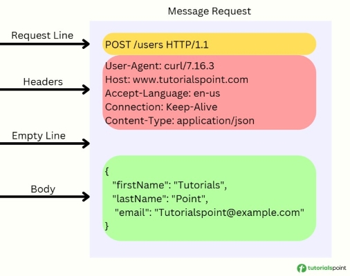

# **Sistemas Distribuidos**
*Autor:* Christian Velasco Pérez 
\
El siguiente contenido corresponde a un **apoyo** educativo para cualquier interesado y por eso puede contener fallos. El documento está orientado al curso de *Sistemas Distribuidos* del Grado en Ingeniería Informática de la Universidad de La Rioja y se considera completa responsabilidad del lector lo que haga con la información de este documento.
\
La distribución del documento queda reservada al permiso explícito de su autor. Si necesitase información de contacto puede [enviar un correo](mailto:velskopezz@gmail.com).

# TEMA 1: Entrada/Salida en Java

## Streams

El **stream** es una conexión por la que viaja un flujo de **bytes**. Los streams existen por igual en todos los lenguajes y deben **cerrarse** tras su uso.

> Cita: Es pregunta de examen qué viaja por un stream (Respuesta: bytes).

## [`OutputStream`](https://docs.oracle.com/javase/8/docs/api/java/io/OutputStream.html)

- `close(): void`; cierra el stream
- `flush(): void`; envía los datos y los libera de la queue
- `write(int): void`; envía el valor numérico del byte a la queue
- `write(byte[]): void`; envía los bytes a la queue
- `write(byte[], int, int)`; envía los bytes desde el byte indicado hasta la cantidad que se indique respectivamente

## [`FileOutputStream`](https://docs.oracle.com/javase/8/docs/api/java/io/FileOutputStream.html)

Es una subclase similar a `OutputStream` enfocado en **escribir ficheros**. Es por ello que su método `write(int[]): void` funciona de forma similar.

## [`DataOutputStream`](https://docs.oracle.com/javase/8/docs/api/java/io/DataOutputStream.html)

Es un filtro que proporciona métodos para tratar con datos de forma lógica en vez de usar bytes.

> Entre sus métodos, `writeBytes(String): void` trata con Strings.

> El método para caracteres y UTF es desaconsejado por el profesor:
> - El primero envía los caracteres línea a línea.
> - El segundo, lejos de utilizar UTF-8, utiliza un UTF específico de Java.

Se usa de acuerdo con el siguiente ejemplo:
```java
DataOutputStream dos = new DataOutputStream(new OutputStream());
```

## [`PrintStream`](https://docs.oracle.com/javase/8/docs/api/java/io/PrintStream.html)

`System.out` es de tipo `PrintStream`, por ejemplo.

## [`InputStream`](https://docs.oracle.com/javase/8/docs/api/java/io/InputStream.html)

Los métodos funcionan de forma análoga a los de `OutputStream`, reemplazando las palabras `write` por **`read`**. En lugar de `void`, devuelven un **`int` con la cantidad de bytes** recibidos. Salvo, por supuesto, `read(byte[]): int`, que devuelve `-1` en caso de error.

> Si no queda lo suficientemente claro me lo hacéis saber.

## [`FileInputStream`](https://docs.oracle.com/javase/8/docs/api/java/io/FileInputStream.html)
Análogo. Es más lento que `BufferedReaded`.

## [`SequenceInputStream`](https://docs.oracle.com/javase/8/docs/api/java/io/SequenceInputStream.html)

## [`DataInputStream`](https://docs.oracle.com/javase/8/docs/api/java/io/DataInputStream.html)

Análogo. Utiliza `readLine(): String` para leer una línea.

## [Reader](https://docs.oracle.com/javase/8/docs/api/java/io/Reader.html)s y [Writer](https://docs.oracle.com/javase/8/docs/api/java/io/Writer.html)s

Debido al encoding, se utilizan para que el paso de los caracteres sea correcto. Aunque los caracteres de ASCII no suelen dar problemas, vale la pena tener esto en cuenta.
\
Para ello, se utilizan clases como [**`BufferedReader`**](https://docs.oracle.com/javase/8/docs/api/java/io/BufferedReader.html), por ejemplo, como **filtros de clase**.

## Try with Resources

Se cierran en orden inverso a la declaración. Se usa de la siguiente forma, como ilustra el ejemplo.
```java
try (FileInputStream ifile = new FileInputStream(ipath);
    FileOutputStream ofile = new FileOutputStream(opath);
    /* . . . */) {
    // bloque de código
} catch (FileNotFoundException fnfe) {
    fnfe.printStackTrace();
} catch (IOException ioe) {
    ioe.printStacktrace();
}
// no hace falta un bloque finally
```

## [`File`](https://docs.oracle.com/javase/8/docs/api/java/io/File.html)

Representa los archivos a un nivel exterior. Su objetivo es proporcionar los **metadatos** del archivo.

## Serialización

Para ello se facilita el método `readOject(): Object` que permite obtener objetos de flujos que implementan la interfaz `Serializable`.

Al fichero se envía el **estado del objeto**, no sus métodos puesto que son generalizados. Se puede añadir las *keywords* **`transient`** o **`static`** para **evitar que se envíe el atributo en la serialización**.

Los **Object** tienen un atributo lamado **serialVersionUID**. Esta se ve alterada con el cambio de la clase. Se puede forzar de forma arbitraria con una sentencia **`static final long serialVersionUID = [ . . . ]`**. Esto se suele hacer para realizar cambios. Los **métodos** no se guardan a la serialización por lo que no da mucho problema. Los **atributos** se asocian con las que tienen el **mismo nombre** y, si no existiera, se trabaja con su forma de **preinicialización**

> e.g.: la preinicialización de un objeto de clase es `null`, la de los `int` es `0`, la de los `boolean` es `false`... 

# TEMA 2: Programación en red en Java

## [`java.net.InetAddress`](https://docs.oracle.com/javase/8/docs/api/java/net/InetAddress.html)

Es una clase que permite **obtener información de la red**. Se instancia por medio de una factoria: sigue un patrón **Factory**.

- `getHostName(): String`
- `getCanonicalHostName(): String`
- `getHostAddress(): String`
- `getAddress(): byte[]`

## [`Socket`](https://docs.oracle.com/javase/8/docs/api/java/net/Socket.html)

Desde la perspectiva del cliente se puede conectar a un socket (combinación de dirección IP y puerto) usando esta API.

| | **Origen** | **Destino**
--: | :-- | :--
Puerto | `getLocalPort()` | `getPort()`
Dirección | `getLocalInetAddress` | `getInetAddress()`

La información a partir del `Socket` se envía por ***streams***. Esto implica que pueden aplicarse los **mismos filtros que con ficheros** (`DataInputStream`, `BufferedReader`...), lo que también implica que **cerrar el filtro también cierra el *socket*** y, por consiguiente, la conexión.

Respecto a la WorldWideWeb, implica el uso de **HTTP** y **servidores**.

## HTTP

Utiliza URLs, se suele usar para páginas web aunque es un protocolo de transferencia de información para cualquier uso de la **capa de aplicación**.

Funciona de tal manera que **cada respuesta está asociada a una petición** y viceversa, es decir, **varias respuestas requieren varias peticiones**.

> Los comandos más utilizados incluyen:
>
> - `GET`
> - `POST`
> - `PUT`
> - `DELETE`
> - `HEAD`
>
> > `DELETE` es comúnmente rechazado por servidores públicos puesto que el usuario no suele tener la autoridad necesaria para utilizarlo.

No guarda estados aunque permite *jugar* con la información por medio de ***cookies***. De forma coasional, en la URL también puede haber una ***StringQuery*** visible tras un caracter `?` en forma de clave-valor y separados por un '&'.

> e.g.: Google lo utiliza para registrar telemetría.

### Estructura HTTP



> Hay que evitar leer el tráfico de red con `BufferedReader` puesto que **lee de más** al almacenar parte del mensaje en un *buffer*. `BufferedReader` está específicamente diseñado para leer ficheros y de texto.

### `GET`

La línea de petición se visualiza con el ejemplo: `GET /index.html HTTP/1.1`.

> Es poco común ver cuerpo en `GET` puesto que este comando sirve para obtener información.

Una respuesta puede comenzar con la línea `HTTP/1.1 200 OK`. De ahí, nuevamente puede haber, o no, cuerpo con mensaje.

### Cabeceras destacables

- **`Content-Length`**: longitud del cuerpo del mensaje
- **`Content-Type`**: utiliza **MIME** para indicar el tipo de archivo
- `Date`
- `Referer`
- `User-Agent`
- ...

> Para información adicional sobre `Content-Type` véase la capa de aplicación en [Redes de Computadores](../2º/Redes_de_Computadores.md)

## Herramientas de servidor

### [`ServerSocket`](https://docs.oracle.com/javase/8/docs/api/java/net/ServerSocket.html)

Es una clase que proporciona la posibilidad de abrir un servidor:

- `ServerSocket(int)`; constructor, abre la conexión en el puerto indicado
- `accept(): Socket`; devuelve un `Socket` con el cliente conectado

> El método `accept(): Socket` de `ServerSocket` es un método **bloqueante**, es decir, detendrá el código en ese punto hasta que se conecte un usuario. Para ello existen métodos de *timeout*, aunque lo lógico es utilizar *multithread*.

```java
// Estructura estándar de un servidor en java
try (ServerSocket server = new ServerSocket(INTERNAL_PORT)) {
    while (true) {
        try (Socket client = server.accept()) {
            // ...
        }
    }
}
```

### *Multithread*

Se ve con detenimiento en el próximo tema. Permite el **paralelismo** aumentando rápidamente la velocidad por medio del uso de múltiples núcleso. Se crea un *thread* por cliente y se utiliza un ***pool* de *threads*** para optimizar su creación.