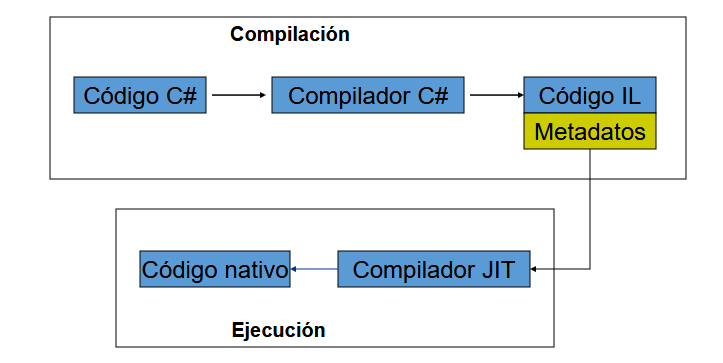

# **Tecnología Orientada a Objetos**
*Autor:* Christian Velasco Pérez 
\
El siguiente contenido corresponde a un **apoyo** educativo para cualquier interesado y por eso puede contener fallos. El documento está orientado al curso de *Tecnología Orientada a Objetos* del Grado en Ingeniería Informática de la Universidad de La Rioja y se considera completa responsabilidad del lector lo que haga con la información de este documento.
\
La distribución del documento queda reservada al permiso explícito de su autor. Si necesitase información de contacto puede [enviar un correo](mailto:velskopezz@gmail.com).

# TEMA 1: Introducción a .NET
Fue inicialmente creado por **Microsoft en los 2000** aunque hoy en día es mantenido por una fundación. Al principio se basó fuertemente en J2E. Fue un gran cambio para los sistemas operativos de Microsoft. Fue importante para unir **dispositivos de distinto tipo**. El fin es proporcionar herramientas para integrar código.

.NET tiene compatibilidad con cientos de lenguajes de programación siendo aquel para el que está pensado **C#**.

## .NET Framework
Es el abstractor del sistema operativo, equivalente a la JVM.

## .NET Core
A partir de 2015 se demanda una versión para **otros sistemas operativos**. A diferencia de .NET Framework, .NET Core es mucho más **modular**, además, es totalmente *open source* y está gestionado por la Fundación .NET en lugar de Microsoft.

## Framework
El objetivo es **maximizar la *portabilidad* y la *reutilización*** del *software*. Para eso hay que **contruir sobre estándares**, por lo que existen colecciones de clases en forma de **DDL**s.

## Compilación
Utiliza un proceso de doble compilación con un **lenguaje intermedio**, **metadatos** y **compilador JIT**.

