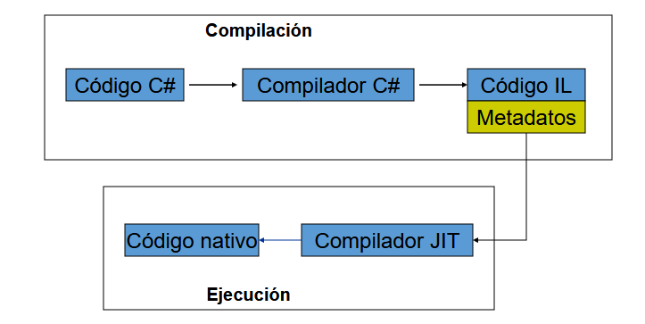
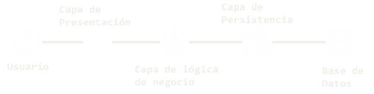

# **Tecnología Orientada a Objetos**
*Autor:* Christian Velasco Pérez 
\
El siguiente contenido corresponde a un **apoyo** educativo para cualquier interesado y por eso puede contener fallos. El documento está orientado al curso de *Tecnología Orientada a Objetos* del Grado en Ingeniería Informática de la Universidad de La Rioja y se considera completa responsabilidad del lector lo que haga con la información de este documento.
\
La distribución del documento queda reservada al permiso explícito de su autor. Si necesitase información de contacto puede [enviar un correo](mailto:velskopezz@gmail.com).

# TEMA 1: Introducción a .NET
Fue inicialmente creado por **Microsoft en los 2000** aunque hoy en día es mantenido por una fundación. Al principio se basó fuertemente en J2E. Fue un gran cambio para los sistemas operativos de Microsoft. Fue importante para unir **dispositivos de distinto tipo**. El fin es proporcionar herramientas para integrar código.

.NET tiene compatibilidad con cientos de lenguajes de programación siendo aquel para el que está pensado **C#**.

- .NET Framework
    \
    Es el abstractor del sistema operativo, equivalente a la JVM.

- .NET Core
    \
    A partir de 2015 se demanda una versión para **otros sistemas operativos**. A diferencia de .NET Framework, .NET Core es mucho más **modular**, además, es totalmente *open source* y está gestionado por la Fundación .NET en lugar de Microsoft.

## Framework
El objetivo es **maximizar la *portabilidad* y la *reutilización*** del *software*. Para eso hay que **contruir sobre estándares**, por lo que existen colecciones de clases en forma de **DDL**s.

## Compilación
Utiliza un proceso de doble compilación con un **lenguaje intermedio**, **metadatos** y **compilador JIT**.



## .NET Framework

### CLR

Entre distintos niveles:

- **Bajo nivel**: proporciona tratamiento de punteros elegible y otros **sistemas críticos**

- **Medio nivel**: utiliza reglas para usar múltiples lenguajes de programación

> Los tipos de datos primitivos son, en realidad, clases *wrapper* o envolventes, es decir, realmente no se trabaja con tipos primitivos.

### Librerías

Es **BCL** un conjunto de **APIs** con clases usables y extensibles.
\
Las APIs componen el **alto nivel**. Estas APIs vienen organizadas en **namespaces**.

## Arquitectura de 3 niveles

Una arquitectura consiste en **identificar componentes y cómo se relacionan**. Cabe destacar que una **clase auxiliar no es un componente**.

Arquitectura de capas significa la separación de una tarea lógica en distintas capas de *software* que funcionan a modo de adaptador conceptual.
\
Una **capa** tiene fuerte **cohesión interna**, es decir, se encarga de una **única tarea**.

> Para información adicional, véase el concepto de cohesión y acoplamiento en [Ingeniería del Software](../2º/Ingeniería_del_Software.md).

Es tarea clave de la **gestión de dependencias**. Hay una dependencia por cada *flecha* del diagrama de diseño UML. Esto implica que un buen diseño trata de **evitar ciclos de dependencias y servicios innecesarios**.

El **acoplamiento** no sólo existe a nivel extra modular. Un módulo puede estar acoplado si así lo está internamente.



> Para información adicional respecto a la capa de persistencia véase [Programación de Bases de Datos](../2º/Programación_de_Bases_de_Datos.md).

# TEMA 2: Introducción a C#

Es un lenguaje de programación **orientado a objetos** pero, además, **orientado a componentes**. Esto se debe al **interés de Microsoft** por proporciona interfaz gráfica. Es parecido a Java, lenguaje predominante en su época, para atraer a sus programadores junto con la unión de C++ y VisualBasic.

Muchas de las **características de C#** vienen dadas por **.NET Framework**. Proporciona **sencillez** en forma de módulos **autocontenidos** y **tamaño fijo de tipos de datos**. Además, proporciona **modernidad** en forma de **`string`**, **`decimal`** y estructuras **`foreach`**, además de **eventos**, **manipulación de errores** y **programación de GUI** sencilla.

## Orientación a objetos

Proporciona herramientas como la **herencia** de forma que una instancia de una clase también es **instancia de su clase padre** y, por tanto, hereda sus atributos y métodos de forma recursiva. Se premite herencia simple de clases y múltiple de interfaces.

Por consecuencia, una herencia que permite **polimorfismo**, es decir, que una clase pueda ser instanciada como una de sus distintas clases hijas y que, usando el mismo método, de acuerdo con su instancia, se comporta de forma distinta. Dicho de otra forma, un método tiene muchas formas.

> Para más información sobre orientación a objetos véase la asignatura Programación Orientada a Objetos.

También se incluye la encapsulación de la información.

> El modificador por defecto de encapsulación es **`internal`**, es decir, sólo visible por el mismo módulo.

> Para información adicional sobre buenas prácticas de programación en orientación a objetos véase [Ingeniería del Software](../2º/Ingeniería_del_Software.md).

## Orientación a componentes

Está íntimamente relacionado con el modificador de visibilidad y la **protección del código**.

Para solucionar el problema de la degradación de legibilidad al programador, existen las **propiedades**. Funciona de tal forma que los *getters* y *setters* se visualizan a efectos prácticos como **atributos de clase**, aunque tan solo es una capa de abstracción. También admite utilizar datos calculados por medio similar a los métodos.

```csharp
// Ejemplo de property en C#
public int var {
    get {
        return this.var;
    }
    set {
        // uso de la keyword "value"
        this.var = value;
    }
}
```

> También existe una forma simplificada cuyo significado es el mismo que el del código de ejemplo anterior:
>
> ```csharp
> public int var { get; set; }
> ```

> Si quisiera hacerse público sólo el *getter* se puede hacer de la siguiente forma:
>
> ```csharp
> public int var { get; private set; }
> ```

> Por flexeo del autor se adjunta un ejemplo de propiedad en Python:
>
> ```python
># Ejemplo de property en Python
> 
># Se adjunta la clase
>class NombreClase:
>    # la '_' al inicio indica que es un atributo privado
>    # ": int" es una notación opcional para indicar la intención del programador aunque el intérprete no la valora
>    _var: int
>
>    # "__init__" es el constructor
>    # todos los métodos no estáticos deben pasarse 'self', análogo de this, como argumento
>    # "-> None" es una anotación opcional para indicar el retorno de función aunque el intérprete no la valora
>    def __init__(self) -> None:
>        self._var = 0
>
>    # "@property" es anotación obligatoria para indicar propiedad
>    @property
>    def var(self) -> int:
>        return self._var
>
>    # "__str__" es el equivalente a ToString() de C#
>    # también se puede usar "var: " + str(self._var)
>    def __str__(self):
>       return f"var: {self._var}"
> ```